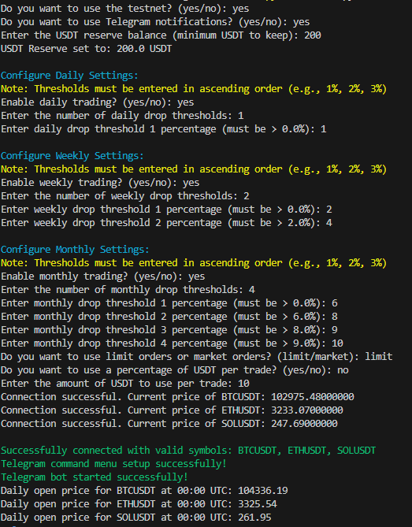
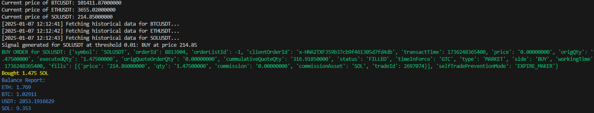

## Installation and Usage of the Binance Bot

### Prerequisites

- Python 3.7 or higher
- A Binance account
- A Telegram account for notifications (optional)

### Installation

1. **Clone the repository**
    ```sh
    git clone https://github.com/your-username/binance-bot.git
    cd binance-bot
    ```

2. **Create and activate a virtual environment**
    ```sh
    python -m venv venv
    source venv/bin/activate  # On Windows: venv\Scripts\activate
    ```

3. **Install dependencies**
    ```sh
    pip install -r requirements.txt
    ```

4. **Copy the configuration template and edit the configuration file**
    ```sh
    cp config/config_template.json config/config.json
    ```
    Edit the file [config.json](http://_vscodecontentref_/3) and add your Binance and Telegram API keys:
    ```json
    {
         "BINANCE_API_KEY": "YOUR_BINANCE_API_KEY",
         "BINANCE_API_SECRET": "YOUR_BINANCE_API_SECRET",
         "TESTNET_API_KEY": "YOUR_TESTNET_API_KEY",
         "TESTNET_API_SECRET": "YOUR_TESTNET_API_SECRET",
         "TRADING_SYMBOLS": ["BTCUSDT", "ETHUSDT", "SOLUSDT"], 
         "QUANTITY_PERCENTAGE": 0.1, 
         "TIME_INTERVAL": "1d",
         "TELEGRAM_TOKEN": "YOUR_TELEGRAM_BOT_TOKEN",
         "TELEGRAM_CHAT_ID": "YOUR_TELEGRAM_CHAT_ID",
         "DROP_THRESHOLDS": [0.01, 0.02, 0.03]  
    }
    ```

### Usage

1. **Start the bot**
    ```sh
    python main.py
    ```

2. **Select Testnet or Live Network**
    When starting, you will be asked if you want to use the Testnet. Answer with `yes` or `no`.

3. **Select Telegram notifications**
    When starting, you will be asked if you want to use Telegram notifications. Answer with `yes` or `no`.

4. **Set the drop thresholds**
    When starting, you will be asked to enter the number of drop thresholds and their percentages in ascending order (e.g., 1 for 1%, 2 for 2%, etc.).

5. **Select order type**
    When starting, you will be asked if you want to use limit orders or market orders. Answer with `limit` or `market`.

6. **Set trade amount**
    When starting, you will be asked if you want to use a percentage of USDT per trade or a fixed amount. Enter the percentage or the fixed amount accordingly.

7. **Telegram commands** (if Telegram is enabled)
    - `/balance`: Shows the current account balance.
    - `/trades`: Shows the total number of trades done.
    - `/profits`: Shows the current profits.

### Example Screenshots

#### Bot Starting


#### Bot Buying


### Disclaimer

This bot is available to everyone. Losses and usage are at your own risk.

### TODO

- Fully manageable via Telegram
- Implement multiple strategies
- Support for other exchanges
- Backtesting capabilities
- Local UI for management

### Contact


You can reach me on Discord: **maskiplays**