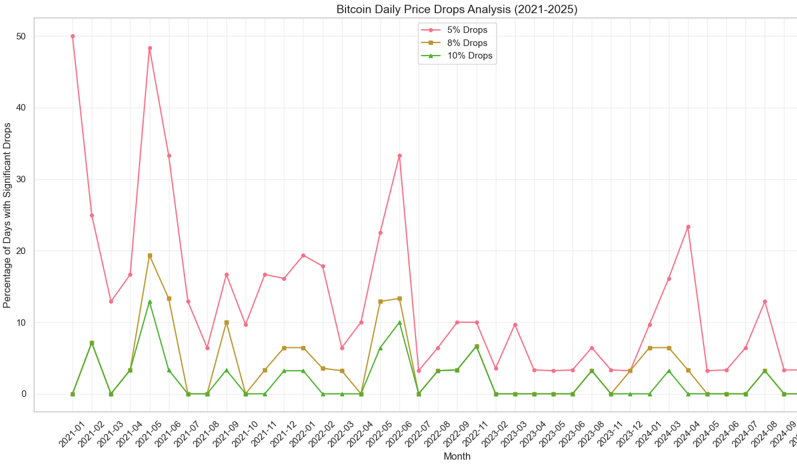
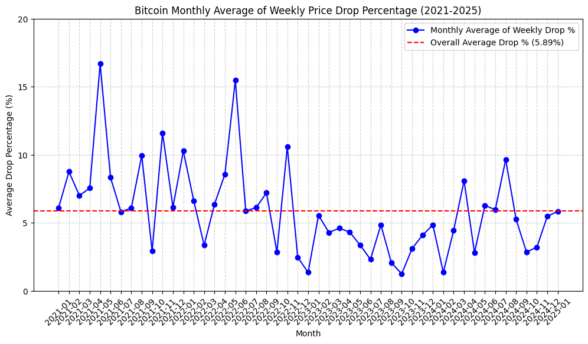
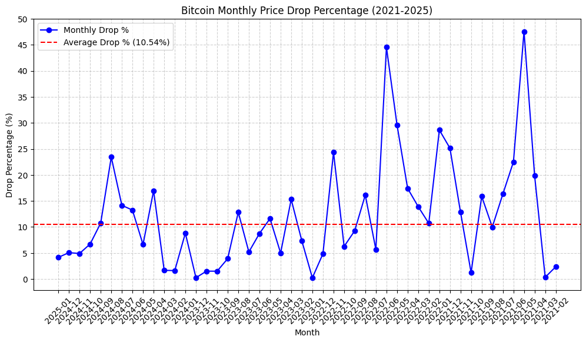

          ___                                      .-~. /_"-._
        `-._~-.                                  / /_ "~o\  :Y
              \  \                                / : \~x.  ` ')
              ]  Y                              /  |  Y< ~-.__j
             /   !                        _.--~T : l  l<  /.-~
            /   /                 ____.--~ .   ` l /~\ \<|Y
           /   /             .-~~"        /| .    ',-~\ \L|
          /   /             /     .^   \ Y~Y \.^>/l_   "--'
         /   Y           .-"(  .  l__  j_j l_/ /~_.-~    .
        Y    l          /    \  )    ~~~." / `/"~ / \.__/l_
        |     \     _.-"      ~-{__     l  :  l._Z~-.___.--~
        |      ~---~           /   ~~"---\_  ' __[>
        l  .                _.^   ___     _>-y~
         \  \     .      .-~   .-~   ~>--"  /
          \  ~---"            /     ./  _.-'
           "-.,_____.,_  _.--~\     _.-~
                       ~~     (   _}       
                              `. ~(
                                )  \
                          /,`--'~\--'~\
                          ~~~~~~~~~~~~~~~~~~~~~~~~~~~~~~~~~~~~~~~
                         Trade-a-saurus Rex 🦖📈
```

# Trade-a-saurus Rex

A personal hobby project - An automated cryptocurrency trading bot for Binance that monitors price drops across multiple timeframes.

## 🦖 What is Trade-a-saurus Rex?

This bot watches for significant price drops in cryptocurrencies and automatically places buy orders when opportunities arise. Think of it as a digital dinosaur hunting for trading opportunities!

## Key Features 🚀

- 🕒 Multi-timeframe monitoring (daily, weekly, monthly)
- 📊 Real-time portfolio tracking with P/L calculations
- 🎯 Dynamic threshold-based buying
- 🔄 Auto-cancellation of unfilled orders
- 🤖 Telegram integration for monitoring and control
- 📈 Tax-adjusted profit calculations (28%)
- 🎨 Chart position visualizations after Order Executions
- 💰 USDT/USDC balance protection
- 📊 Enhanced visualization tools with balance history charts
- 🗄️ MongoDB persistence of thresholds and reference prices
- 🔁 Threshold state restoration after restart
- 🐳 Docker support (works best when running on Server)
- ⚡ Flexible database driver support (async Motor or sync PyMongo)
- 📋 Symbol management with persistent storage
- 🧹 Proper cleanup of orders and thresholds when removing symbols
- 💎 Visual highlighting of active trading assets in balance output

## Prerequisites

- Python 3.7+
- MongoDB
- Binance account
- Telegram bot token

## Quick Start

1. **Setup**
   ```bash
   git clone https://github.com/yourusername/Trade-a-saurus-Rex.git
   cd Trade-a-saurus-Rex
   pip install -r requirements.txt
   ```

2. **Configure**
   - Copy `config/config_template.json` to `config/config.json`
   - Add your API keys and settings

## Telegram Commands

- `/start` - Start the bot and show welcome message
- `/power` - Toggle trading on/off
- `/balance` - Check current balance
- `/stats` - Trading statistics
- `/profits` - P/L analysis with tax calculations 
- `/history` - View recent order history
- `/thresholds` - Show threshold status and resets
- `/add` - Add manual trade (interactive)
- `/resetthresholds` - Reset all thresholds across timeframes
- `/viz` - Show data visualizations (volume, profit, balance charts)
- `/menu` - Show all available commands

## Recent Updates and Improvements

- **Flexible Database Driver Support**: Choose between Motor (async) and PyMongo (sync) database drivers
- **Asynchronous MongoDB Implementation**: Upgraded to Motor for async MongoDB operations, boosting performance and responsiveness
- **Symbol Management System**: Added complete lifecycle management for trading symbols with persistence across bot restarts
- **Enhanced Data Persistence**: All thresholds and reference prices are now stored in MongoDB for reliable recovery after restarts
- **Threshold Restoration**: Bot now properly restores triggered thresholds after a restart
- **Improved Visualization Tools**: Added balance history charts and improved trade visualizations
- **Better Error Handling**: Comprehensive error handling throughout the system
- **Fixed Format Strings**: Resolved formatting issues in notifications
- **Optimized MongoDB Queries**: More efficient and robust database operations
- **Reserve Balance Protection**: Enhanced reserve balance protection to prevent over-trading
- **Command Improvements**: Added `/resetthresholds` command for manual reset
- **Lower Entries Protection**: Added protection to prevent increasing average entry price with commands to control it
- **TP/SL Management**: Added Take Profit and Stop Loss settings with Telegram commands

## Portfolio Analysis

The bot provides detailed portfolio analysis including:
- Entry/exit points
- Tax-adjusted profits
- Fee calculations
- Multi-timeframe performance
- Balance history tracking

## Docker Support

The bot can run in Docker for improved stability and easier deployment on servers:

```bash
docker-compose up -d
```

## Note on Drop Analysis

At the bottom of this repository, you'll find historical price drop analyses for BTC. These analyses can help you optimize the threshold settings in your config file for better trading results.

## Disclaimer

This is a hobby project and should not be used for serious trading without thorough testing. Trade at your own risk!

## License

MIT License


## ✅ TODO  


### ✅ Finished  
- ✅ **Include TP and SL in Chart Generation.**
- ✅ **Telegram - Open Orders Command**  
- ✅ **Reserve Balance**  
- ✅ **Chart Generation**  
- ✅ **Reset Updates Send**  
- ✅ **MongoDB Integration**  
- ✅ **Migrating from SQLite**  
- ✅ **Docker Support**  
- ✅ **Threshold Persistence**  
- ✅ **Balance History Charts**  
- ✅ **Format String Fixes**  
- ✅ **Percentage-based Take Profit and Stop Loss**  
- ✅ **"Only Lower Entries" Setting** (prevent increasing average entry price)
- ✅ **Add commands to toggle lower entry price protection**


 Readme**

## Analysis




