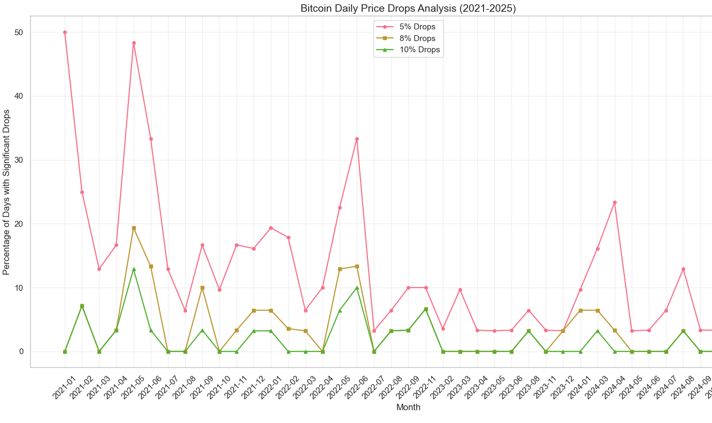
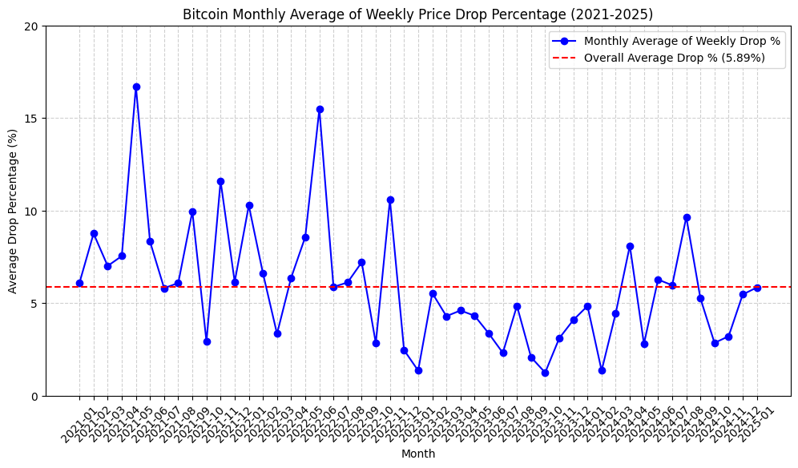
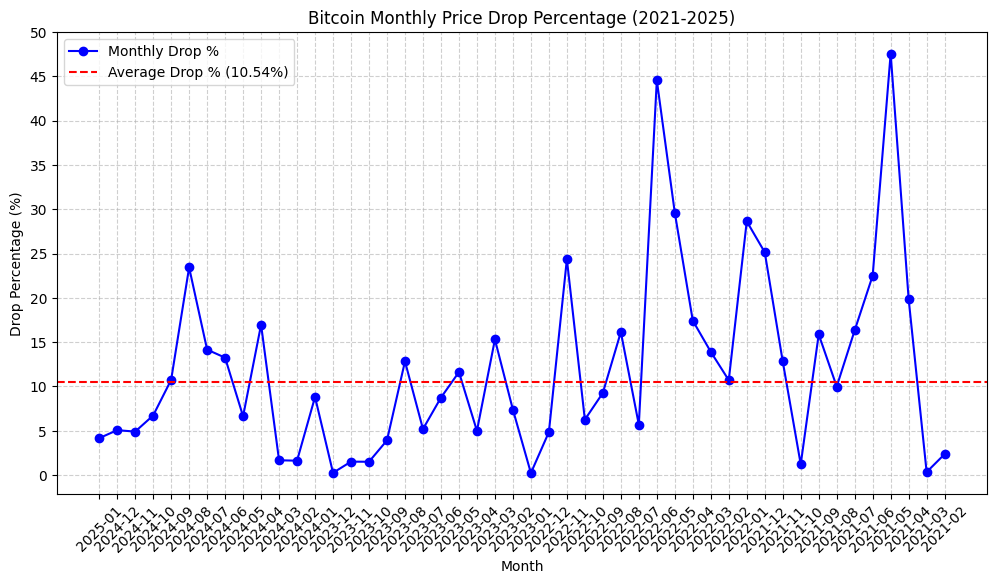

```
          ___                                      .-~. /_"-._
        `-._~-.                                  / /_ "~o\  :Y
              \  \                                / : \~x.  ` ')
              ]  Y                              /  |  Y< ~-.__j
             /   !                        _.--~T : l  l<  /.-~
            /   /                 ____.--~ .   ` l /~\ \<|Y
           /   /             .-~~"        /| .    ',-~\ \L|
          /   /             /     .^   \ Y~Y \.^>/l_   "--'
         /   Y           .-"(  .  l__  j_j l_/ /~_.-~    .
        Y    l          /    \  )    ~~~." / `/"~ / \.__/l_
        |     \     _.-"      ~-{__     l  :  l._Z~-.___.--~
        |      ~---~           /   ~~"---\_  ' __[>
        l  .                _.^   ___     _>-y~
         \  \     .      .-~   .-~   ~>--"  /
          \  ~---"            /     ./  _.-'
           "-.,_____.,_  _.--~\     _.-~
                       ~~     (   _}       
                              `. ~(
                                )  \
                          /,`--'~\--'~\
                          ~~~~~~~~~~~~~~~~~~~~~~~~~~~~~~~~~~~~~~~
                         Trade-a-saurus Rex 🦖📈
```

# Trade-a-saurus Rex

A personal hobby project - An automated cryptocurrency trading bot for Binance that monitors price drops across multiple timeframes.

## 🦖 What is Trade-a-saurus Rex?

This bot watches for significant price drops in cryptocurrencies and automatically places buy orders when opportunities arise. Think of it as a digital dinosaur hunting for trading opportunities!

## Key Features 🚀

- 🕒 Multi-timeframe monitoring (daily, weekly, monthly)
- 📊 Real-time portfolio tracking with P/L calculations
- 🎯 Dynamic threshold-based buying
- 🔄 Auto-cancellation of unfilled orders
- 🤖 Telegram integration for monitoring and control
- 📈 Tax-adjusted profit calculations (28%)
- 🎨 Chat position visualizations after Order Executions
- 💰 USDT balance protection
- 🐳 Docker support (works best when running on Server)

## Prerequisites

- Python 3.7+
- MongoDB
- Binance account
- Telegram bot token

## Quick Start

1. **Setup**
   ```bash
   git clone https://github.com/yourusername/Trade-a-saurus-Rex.git
   cd Trade-a-saurus-Rex
   pip install -r requirements.txt
   ```

2. **Configure**
   - Copy `config/config_template.json` to `config/config.json`
   - Add your API keys and settings


## 📝 Configuration Guide

### Environment Settings
```json
"environment": {
    "testnet": true,          // Use testnet (true) or mainnet (false)
    "trading_mode": "futures" // "spot" or "futures"
}
```

### API Configuration
```json
"binance": {
    "mainnet": {
        "api_key": "your_mainnet_api_key",
        "api_secret": "your_mainnet_api_secret"
    },
    "testnet_spot": {
        "api_key": "your_testnet_spot_key",
        "api_secret": "your_testnet_spot_secret"
    },
    "testnet_futures": {
        "api_key": "your_testnet_futures_key",
        "api_secret": "your_testnet_futures_secret"
    }
}
```

### Trading Settings
```json
"trading": {
    "base_currency": "USDT",          // Base currency for trading
    "order_amount": 100,              // Amount per order in USDT
    "cancel_after_hours": 8,          // Cancel unfilled orders after X hours
    "reserve_balance": 500,           // Minimum balance to maintain
    "pairs": ["BTCUSDT", "ETHUSDT"], // Trading pairs
    "thresholds": {                   // Price drop thresholds
        "daily": [1, 2, 5],          // Trigger at 1%, 2%, 5% drops
        "weekly": [5, 10, 15],       // Weekly thresholds
        "monthly": [10, 20, 30]      // Monthly thresholds
    },
    "futures_settings": {             // Futures-specific settings
        "enabled": true,              // Enable futures trading
        "default_leverage": 5,        // 1-125x leverage
        "margin_type": "ISOLATED",    // "ISOLATED" or "CROSSED"
        "position_mode": "ONE_WAY",   // "ONE_WAY" or "HEDGE"
        "allowed_pairs": [            // Pairs allowed for futures
            "BTCUSDT",
            "ETHUSDT"
        ]
    }
}
```

### MongoDB Settings
```json
"mongodb": {
    "uri": "mongodb://localhost:27017",
    "database": "tradeasaurus"
}
```

### Telegram Settings
```json
"telegram": {
    "bot_token": "your_telegram_bot_token",
    "allowed_users": [123456789]      // List of allowed Telegram user IDs
}
```

## 🔧 Settings Explained

### Thresholds
- Thresholds trigger buy orders when price drops by specified percentages
- Each timeframe (daily/weekly/monthly) maintains separate thresholds
- Lower thresholds trigger first (e.g., 1% before 2%)
- Thresholds reset at their respective intervals

### Futures Settings
- `default_leverage`: Trading leverage (1-125x)
- `margin_type`: 
  - ISOLATED: Risk limited to position margin
  - CROSSED: Shared margin across positions
- `position_mode`:
  - ONE_WAY: Single position per symbol
  - HEDGE: Allow both long/short positions

### Reserve Balance
- Maintains minimum USDT balance
- Prevents trading when balance would drop below reserve
- Trading auto-resumes when balance recovers
- Set to 0 to disable

### Cancel Timer
- Automatically cancels unfilled orders
- Prevents stale orders
- Time set in hours
- Applies to both spot and futures orders

## Telegram Commands

- `/balance` - Current portfolio balance
- `/stats` - Trading statistics
- `/profits` - P/L analysis with tax calculations
- `/add` - Add manual trade
- `/thresholds` - View threshold status
- `/start` - Start the bot and show welcome message
- `/power` - Toggle trading on/off 
- `/balance` - Check current balance

## Portfolio Analysis

The bot provides detailed portfolio analysis including:
- Entry/exit points
- Tax-adjusted profits
- Fee calculations
- Multi-timeframe performance

## Note on Drop Analysis

At the bottom of this repository, you'll find historical price drop analyses for BTC. These analyses can help you optimize the threshold settings in your config file for better trading results.

## Disclaimer

This is a hobby project and should not be used for serious trading without thorough testing. Trade at your own risk!

## License

MIT License


## ✅ TODO  

### 🚀 Work in Progress  
- ⚙️ **Futures Integration** ⏳ (In Progress)  
- 🔗 **Bitget Integration** ⏳ (In Progress)  

### ✅ Finished  
- ✅ **Telegram - Open Orders Command**  
- ✅ **Reserve Balance**  
- ✅ **Chart Generation**  
- ✅ **Reset Updates Send**  
- ✅ **MongoDB Integration**  
- ✅ **Migrating from SQLite**  
- ✅ **Docker Support**

### 📌 Planned  
- 📌 **Weekly & Monthly Summary (Optional)**  
- 📌 **Hyperliquid Integration**
- 📌 **Backtest Option to Test Performance**
- 📌 **Report with real Balance 5k+**
- 📌 **More Detailed Explanation of Config Readme**
- 📌 **Take Profit and Stop Lose for Future Trades**
- 📌 **Add Coins and delete them trough Telegram**
- 📌 **Chart Generation , Equitiy Curve and Buys Marked**
## Analysis




